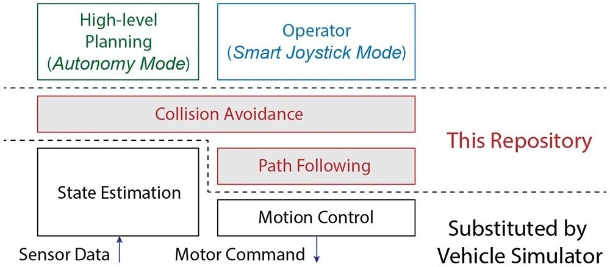
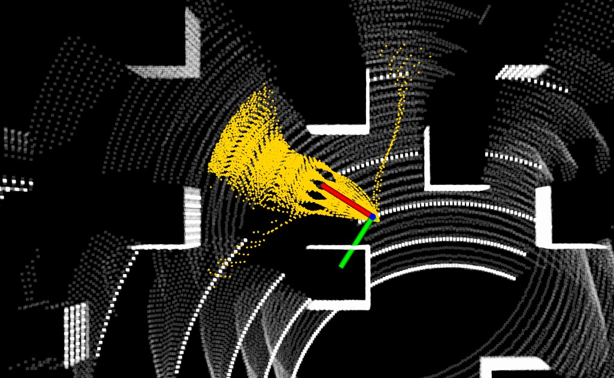
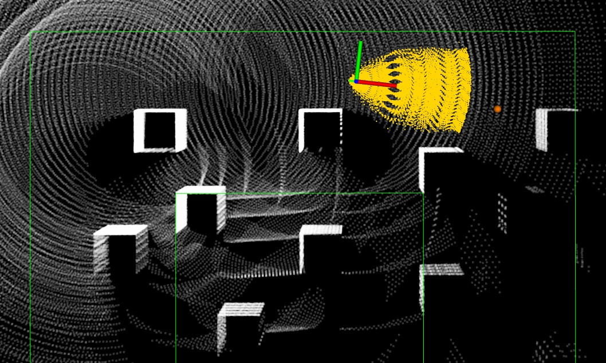

The repository contains code for autonomous navigation and collision avoidance to use with ground robots. In an autonomous navigation system, this repository is often at the mid-level, above the state estimation module and below the high-level planning module, connecting different modules in the navigation system. To help users start easily, the repository includes a vehicle simulator and does not need to run onboard a real robot. The code implementation is targeted at executing on a robot computer with limited processing power. Except for the vehicle simulator, all code in the repository is optimized and lightweight. The code operates in two modes: *autonomy mode* takes waypoints as the input and navigates towards the waypoints while avoiding obstacles along the way, *smart joystick mode* takes commands from an operator through a joystick controller and avoids obstacles that the robot encounters. The *smart joystick mode* is often useful in debugging the navigation system and is highly recommended.

[A video showing functionalities of the code is available.](https://youtu.be/JgJG3Y8JCt0)



# Prerequisite

To use *smart joystick mode*, the system requires a PS3 controller (*autonomy mode* can run without a controller). Most PS3 controllers with a USB or Bluetooth interface would work out of the box. The one that has been tested is an EasySMX 2.4G Wireless Controller. Some controllers have different modes. Make sure the controller is in the right mode (usually the factory default mode) and is powered on. If using the controller in the image, the two LEDs on top of the center button should be lit. Holding the center button for a few seconds changes the mode.


The code runs on a Ubuntu 20.04 computer installed with ROS Noetic. Install ROS joystick driver,

```sudo apt update```

```sudo apt install ros-noetic-joystick-drivers```

Make sure to add the username to dialout group (change 'username' in the command line) and reboot the computer,

```sudo adduser username dialout```

To verify the controller is working, launch ROS joystick driver,

```roslaunch ps3joy ps3.launch```

In another terminal,

```rostopic echo /joy```

Press any button on the controller and joystick messages should display in the terminal.

# Quick Start

Clone the repository and checkout the 'noetic' branch. In a terminal, go to the folder and compile,

```catkin_make```

Source the ROS workspace,

```source devel/setup.sh```

To launch the code in *smart joystick mode*, plugin the controller to the computer,

```roslaunch vehicle_simulator system.launch```

Wait for Gazebo to initialize in a few seconds, the following scene will show up in RVIZ with scans in the main window and images on the side. The coordinate frame indicates the robot and the yellow dots are collision-free paths. Now, use the right joystick on the controller to navigate the robot. Pushing the right joystick to the front and back drives the robot around and pushing the right joystick to the left and right makes rotations. Holding the obstacle-check button cancels obstacle checking.



Alternatively, one can launch the code in *autonomy mode*. If a controller is available, uncomment

```<include file='$(find waypoint_example)/launch/waypoint_example.launch' />```

in 'src/vehicle_simulator/launch/system.launch'. This will launch the 'waypoint_example' - an example of sending waypoints, speed, and navigation boundaries. Then,

```roslaunch vehicle_simulator system.launch```

Hold the mode-switch button on the controller and at the same time push the right joystick. The robot will follow the waypoints for one circle. Here, the right joystick gives the speed. If only the mode-switch button is held, the system will start taking speed from the 'waypoint_example' in a few seconds and the robot will start moving.



If a controller is unavailable, set 'autonomyMode = true' in 'src/local_planner/launch/local_planner.launch'. Launch the 'waypoint_example' together with the system. The system will start in *autonomy mode*. Note that you can set 'autonomyMode = true' even if a controller is plugged-in. Pressing any button on the controller will bring the system to *smart joystick mode* and holding the mode-switch button will bring the system back to *autonomy mode*.

# Advanced

**Changing simulation environment**: The vehicle simulator supports custom environments. To change the environment, replace 'example.world' by 'mesh.world' in 'src/vehicle_simulator/launch/vehicle_simulator.launch'. Then, modify 'src/vehicle_simulator/world/mesh.world' to update the directory to the mesh file ('/path_to_folder/meshfile.dae' at two places) and offset ('pose frame = [0 0 0 0 0 0]' at the bottom). [An example mesh file can be downloaded from here.](https://github.com/osrf/gazebo_models/blob/master/willowgarage/meshes/willowgarage_collision.dae) To check the mesh file is loaded correctly, set 'gui = true' in 'src/vehicle_simulator/launch/vehicle_simulator.launch'. Additionally, if the environment contains 3D terrain, set 'adjustZ = true' and 'adjustIncl = true' to adjust robot elevation and inclination according to the terrain. Set 'terrainZ' to the terrain elevation at the start position. Note that terrain analysis needs to run for the feature to be functional. See instruction below to turn on terrain analysis.

**Running on real robot**: The system is setup to use a vehicle simulator for a quick start. The vehicle simulator publishes 'nav_msgs::Odometry' typed state estimation messages on ROS topic '/state_estimation', '/tf' messages, and 'sensor_msgs::PointCloud2' typed registered scan messages on ROS topic '/registered_scan'. The scans are simulated based on a Velodyne VLP-16 Lidar and are registered in the 'map' frame. To use the code with a real robot, replace the vehicle simulator by the state estimation module on the robot and forward the 'geometry_msgs::TwistStamped' typed command velocity messages on ROS topic '/cmd_vel' to the motion controller. Adjust 'minRelZ' and 'maxRelZ' in 'src/local_planner/launch/local_planner.launch' to crop off the ground and ceiling in the registered scans. The default sensor height is set at 0.75m above the ground in the vehicle simulator and the registered scans are cropped at the height of -0.5m and 0.25m w.r.t. the sensor.

**Integrating with LOAM**: The original implementation of the [Lidar Odometry and Mapping (LOAM)](https://github.com/cuitaixiang/LOAM_NOTED) algorithm uses the camera coordinate convention (x-left, y-up, z-front). This repository uses the standard ground robot convention (x-front, y-left, z-up). If using the original version of LOAM for state estimation, comment out

```<!--include file="$(find vehicle_simulator)/launch/vehicle_simulator.launch" /-->```

and uncomment

```<include file="$(find loam_interface)/launch/loam_interface.launch" />```

in  'src/vehicle_simulator/launch/system.launch'. This will stop launching the vehicle simulator and launch the 'loam_interface' - a bridge to connect the ROS topics and flip the coordinate frames . If using a modified version of LOAM, adjust 'stateEstimationTopic', 'registeredScanTopic', 'flipStateEstimation', and 'flipRegisteredScan' in  'src/loam_interface/launch/loam_interface.launch' to configure the ROS topics and coordinate frames. If playing bagfiles with lidar and optionally IMU data instead of running on a real robot, make sure to set 'use_sim_time = true'. In a terminal,

```roscore```

In another terminal,

```rosparam set use_sim_time true```

Launch LOAM and the system side by side. Then, play bagfiles with '--clock' flag (change 'filename' in the command line),

```rosbag play --clock filename.bag```

**Integrating with high-level planner**: To use the code with a high-level planner, e.g. a route planner, follow the example code in 'src/waypoint_example/src/waypointExample.cpp' to send waypoints, speed, and navigation boundaries. The navigation boundaries in a message are considered connected if they are at the same height and disconnected if at different height.

**Adding additional sensors**: The system can take data from additional sensors for collision avoidance. The data can be sent in as 'sensor_msgs::PointCloud2' typed messages on ROS topic '/added_obstacles'. The points in the messages are in the 'map' frame.

**Obstacle checking on/off**: Obstacle checking can be turned on and off with a 'std_msgs::Bool' typed message on ROS topic '/check_obstacle'. The number in the message indicates obstacle checking is on or off. Alternatively, one can hold the obstacle-check button on the controller to turn off obstacle checking.

**Turning on terrain analysis**: The system uses registered scans for collision avoidance by default. If driving over 3D terrains, terrain analysis becomes necessary. To launch terrain analysis, uncomment

```<include file='$(find terrain_analysis)/launch/terrain_analysis.launch' />```

set 'useTerrainAnalysis = true' and adjust 'obstacleHeightThre' in 'src/local_planner/launch/local_planner.launch'. The terrain analysis publishes 'sensor_msgs::PointCloud2' typed terrain map messages on ROS topic '/terrain_map', with 'pcl::PointXYZI' typed points in the messages. Here, the x, y, z fields of a point indicate the coordinates and the intensity field stores the cost. To check the terrain map in RVIZ while terrain analysis is running, click 'Panels->Displays', uncheck 'RegScan', and check 'terrainMap'. Clicking the clear-terrain-map button on the controller reinitializes the terrain map. Alternatively, one can send a 'std_msgs::Float32' typed message on ROS topic '/map_clearing'. The number in the message indicates the radius of the area to be cleared. Note that terrain analysis does require scans to be well registered. If the state estimation on the robot is imprecise and scans are misregistered, terrain analysis will likely sacrifice.

**Handling negative obstacles**: While the best way to handle negative obstacles is mounting a sensor high up on the robot looking downward into the negative obstacles, a quick solution is turning on terrain analysis and setting 'noDataObstacle = true' in 'src/terrain_analysis/launch/terrain_analysis.launch'. Negative obstacles usually cause some areas to have no data. The system will consider these areas to be non-traversable.

**Tuning path following**: To change driving speed, adjust 'maxSpeed', 'autonomySpeed', and 'maxAccel' in 'src/local_planner/launch/local_planner.launch'. Other path following parameters such as 'maxYawRate', 'yawRateGain', and 'lookAheadDis' are in the same file. If setting 'twoWayDrive = false', the robot will only drive forward.

**Changing robot size**: The system uses motion primitives generated by a MatLab script. To change the robot size, adjust 'searchRadius' in 'src/local_planner/paths/path_generator.m' and run the MatLab script. This will generate a set of path files in the same folder.

**Robot motion model**: The system uses a differential motion model. Adapting to other motion models, e.g. a car-like motion model, needs more work.

# Reference

J. Zhang, C. Hu, R. Gupta Chadha, and S. Singh. Falco: Fast Likelihood-based Collision Avoidance with Extension to Human-guided Navigation. Journal of Field Robotics. vol. 37, no. 8, pp. 1300–1313, 2020. [[**PDF**](https://frc.ri.cmu.edu/~zhangji/publications/JFR_2020.pdf)]

# Author

[**Ji Zhang**](https://frc.ri.cmu.edu/~zhangji)<br/>
The Robotics Institute, Carnegie Mellon University

# Credit

[velodyne_simulator](http://wiki.ros.org/velodyne_simulator) package is from open-source release.
